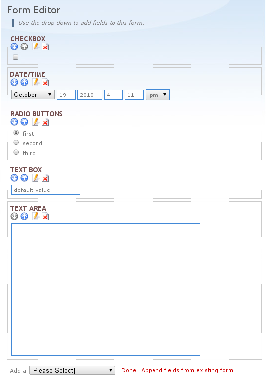

========
evregapp
========

Currently in a planning/design phase. What do we want it to do? And what is out
of the scope of this project?

Features
========

+	Form designer (be able to create forms without coding).

	+	Maybe reuse some widget library, like 
		`ToscaWidgets <http://toscawidgets.org/>`_?
+	Form reuse (be able to clone existing forms and edit them).
+	Get user information from an existing database (e.g. a website CMS
	database). Probably use `SQLAlchemy <http://www.sqlalchemy.org/>`_?
+	Participant list generation (xls, pdf, ...)
+	Generate bank transfer information and verify that the transfer occured;
	this obviously has to be a plugin to allow the use of various banks etc.

**But** - we don't want to depend on any particular CMS or database type (those
are connected) or payment method (money transfer is the primary interest, but
we should support other methods too; "no payment" is an option too).
	
Design
======

We need to agree on the features first, but after that we'll probably have to
pick a framework (`Pylons <http://pylonshq.com/>`_? Or something else?) and
maybe something else.

Form designer
-------------

It would be super cool if it took advantage of JS for drag&drop of widgets.
Right now I'm most influenced by the `Exponent CMS
<http://exponentframework.org/>`_ form module, which looks like this:

Every widget has icons for actions, which include editing the widget settings,
deletion and movement of the widget. (Moving the widgets without page refresh -
through AJAX - would be very helpful).

There is a feature I've seen somewhere else that might be useful. There was a
bunch of checkboxes and selecting one meant selecting a particular meal option
or a service. Each checkbox had a prize and a total calculated from the
selected checkboxes was shown in the bottom. Should this be a widget?

Another feature is multipage and/or non-linear registration forms. For example
if a participant only selects the first day of an event, we can skip all
questions about the other days. How to implement this?

